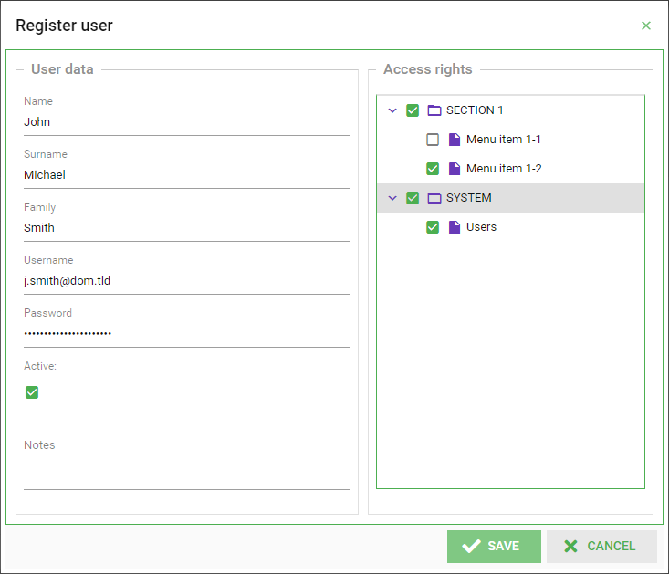

An ExtJS form field component (for the classic toolkit) whose value is determined by the selected nodes of the underlying tree panel.
-------------------------------------



**Source at GitHub**

[https://github.com/wencywww/Ext.ux.form.field.Tree](https://github.com/wencywww/Ext.ux.form.field.Tree)


**Demos**

[Sencha's Fiddle: https://fiddle.sencha.com/#fiddle/3lrr](https://fiddle.sencha.com/#fiddle/3lrr)
<br><br>


**Features:**

  * Can be used as a standard form field everywhere the user needs to select values using a hierarchical data representation
  * For example, if an application has an tree-like navigation menu and the user wants to be able to restrict access to specific items from it
  * Extends [Ext.form.FieldContainer](https://docs.sencha.com/extjs/7.6.0/classic/Ext.form.FieldContainer.html) and uses [Ext.form.field.Field](https://docs.sencha.com/extjs/7.6.0/classic/Ext.form.field.Field.html) mixin to provide form-field functionality such as value getting/setting and validation. The mechanism is similar to this used by [Ext.ux.form.MultiSelect](https://docs.sencha.com/extjs/7.6.0/classic/Ext.ux.form.MultiSelect.html) component and parts of the code are borrowed from there
  * The validity of the field can be controlled via the `allowBlank`, `minSelections` and `maxSelections` configs. As with the other type of fields - the disabled state will omit the validation
  * The field container owns single item - a checkable tree panel which represents the component UI
  * The users manipulates the field value by simply checking/unchecking tree nodes or via the `setValue` method programmatically
  * Setting the value programmatically reflects the checked nodes and vice versa 
  * The `value` of the field is provided as an `array of values` and the `submit value` is `string` which uses the configured `delimiter` to build the submitted string
  * The records provided via the store does not need to have the `checked` property within their data. The component adds the property if it is missing
  * A custom model property can be provided as `valueProperty` config option to indicate where the values must be read from
  * Registers `treefield` / `treeformfield` xtypes for easy instantiation
  * Tested with ExtJS version 6.2.0.981 and up to 7.6.0


<br><br>
**Configuration options**

  * The component extends [Ext.form.FieldContainer](https://docs.sencha.com/extjs/7.6.0/classic/Ext.form.FieldContainer.html) and thus all configurations it supports are supported too (with [configuration options](https://docs.sencha.com/extjs/7.6.0/classic/Ext.tree.Panel.html) for the treepanel itself accepted via the `treeConfig` option below)
  
  Component-specific configurations:
  
  * **store** `(treestore instance or config object; required)`: The store for the underlying tree panel

  * **root** `(root-node config object; required if store is not provided)`: The treepanel can build its store via the root node if the store is not provided. If both store and root are provided - the root will be ignored

  * **valueProperty** `(string, default: 'text')`: The model field which holds the values used to calculate the component value. MAKE SURE THEY ARE UNIQUE!

  * **delimiter** `(string, default: ',')`: Used by the getSumbitValue() method to provide the submitted string value. valueProperty items should not contain this character

  * **allowBlank** `(boolean, default: true)`: If false (and the field is not disabled), the field with 0 selections will be considered and marked invalid with the **blankText** config message

  * **blankText** `(string, default: 'This field is required')`: The error message text when **allowBlank** validation fails

  * **minSelections** `(integer, default: 0)`: Determines the minumum number of selections that should be made. If the checked nodes count is less than this value (and the field is not disabled), the field will be considered and marked invalid with the **minSelectionsText** config message

  * **minSelectionsText** `(string, default: 'Minimum {0} item(s) are required')`: The error message text when **minSelections** validation fails

  * **maxSelections** `(integer, default: Number.MAX_VALUE)`: Determines the maximum number of selections allowed. If the checked nodes count is above this value (and the field is not disabled), the field will be considered and marked invalid with the **maxSelectionsText** config message

  * **maxSelectionsText** `(string, default: 'Maximum {0} item(s) are allowed')`: The error message text when **maxSelections** validation fails

  * **treeConfig** `(object, default: {})`: Can contain any valid config options for the underlying treepanel (see [Ext.tree.Panel]((https://docs.sencha.com/extjs/7.6.0/classic/Ext.tree.Panel.html))) except for the store/root which are provided outside


<br><br>
**Usage**

  * Include the `src/TreeField.js` in you project file (Ext must be included prior to this)
  * Instantiate the class, for example `var myTreeField = Ext.create('Ext.ux.form.field.Tree')`, or using the `'treefield'` ot `'treeformfield'` xtype like this: 
  ```JavaScript
  //The following configuration produces something similar to the screenshot above

  Ext.widget('treefield', {
    fieldLabel: 'UI Access', //label for the field in the form
    hideLabel: true, //hide the label if needed
    valueProperty: 'nodeID', delimiter: '|',
    treeConfig: { //tree-panel specific configs
        singleExpand: true,
        checkPropagation: 'down', //auto-select children
        border: 1,
        rootVisible: false, //hide root node
        useArrows: true,
        viewConfig: {
            stripeRows: true,
            loadMask: true
        }
    },
    root: { //instead of store - one can provide root-node config
      expanded: true, text: 'Root Node', nodeID: 'root',
      children: [
        {
          expanded: true, text: 'SECTION 1', nodeID: '1', children: [
            {text: 'Menu item 1-1', nodeID: '1-1', leaf: true},
            {text: 'Menu item 1-2', nodeID: '1-2', leaf: true},
          ]
        },
        {
          expanded: true, text: 'SYSTEM', nodeID: '2', children: [
            {text: 'Users', nodeID: '2-1', leaf: true}
          ]
        }
      ]
    },
    //the field can be instantiated with a value and the UI will be updated accordingly
    value:['1', '1-2', '2', '2-1']
  });

  //Respectively, the submitted value of field will be: '1|1-2|2|2-1'

  ```
  

**List of Changes**

  * **2022-11-01**, initial commit
